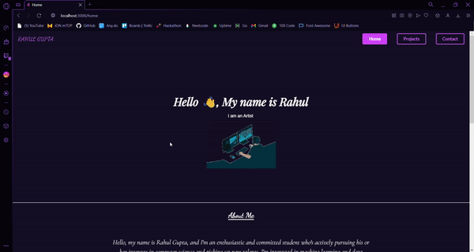
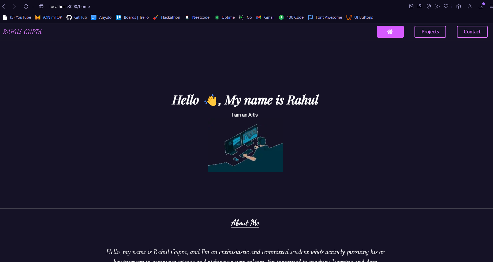
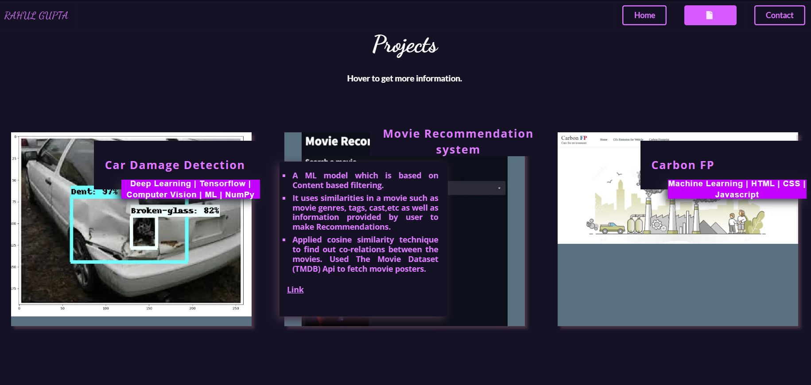
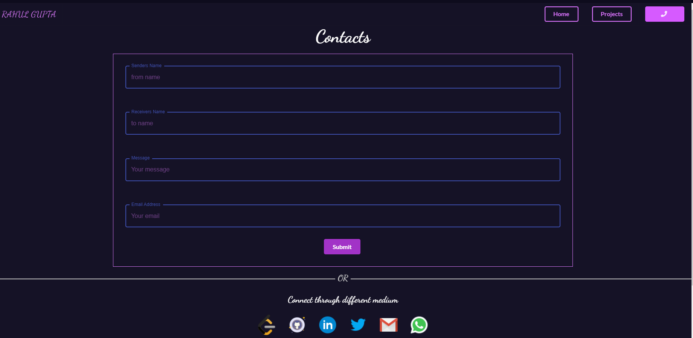
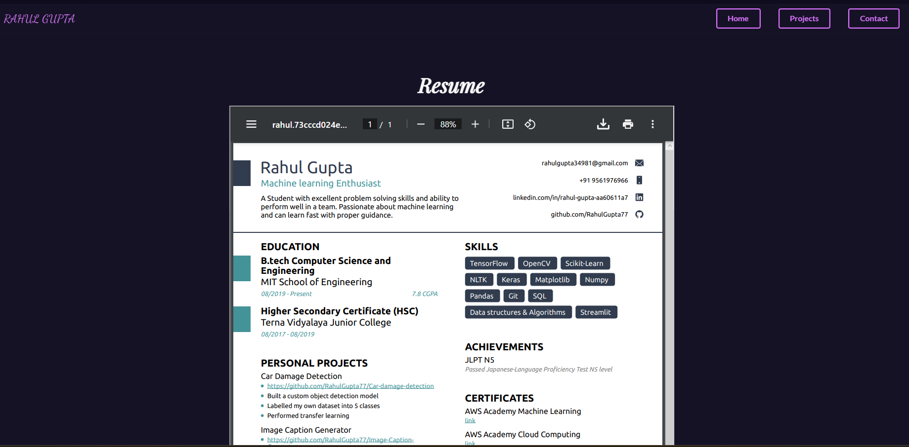

# **Portfolio Website**

---

## Site Link

- [Click here](https://rahul-guptaportfolio.netlify.app/)

## Demo

### Overview:

---

## Tech Stack used

- JavaScript
- React
- Netlify (for hosting)

---

## Libraries used

- EmailJS
- Framer Motion
- Material UI
- Semantic UI

---

## Project Description

- This is a portfolio website built using React, featuring various libraries such as EmailJS, Framer Motion, Material UI, and Semantic UI.
- The website is hosted on Netlify and showcases skills, projects, and contact information of a particular person.
- The website is built with the goal of being easy to navigate and visually appealing, making it a great representation of my work.

---

### Home:

### Projects:

### Contact:

### Resume:

---

